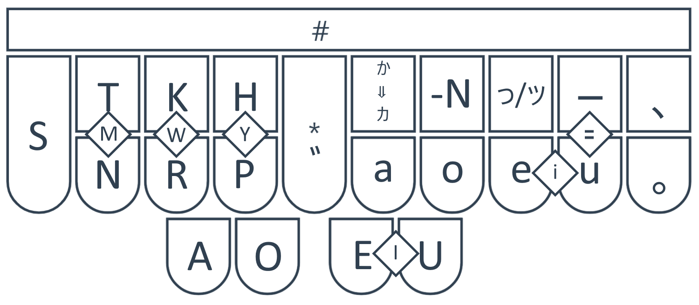

# plover-japanese-dictionary
A programmatic hiragana/katakana syllabic theory for Plover

This is not a full stenographic theory for Japanese. It will not output any kanji. It is educational tool only for hiragana and katakana. The theory allows the output of words phonetically a syllable at a time. Stroke lookup is not supported at this time.
##Installation
1. Open the Plover 4+ Plug-in Manager and ensure the `plover-python-dictionary` and `plover-dict-commands` plug-ins are installed. Restart if necessary.
2. Add nihongo.py as a dictionary, but uncheck it/leave it disabled.
3. Add `"TPHEULG": "{PLOVER:SOLO_DICT:+nihongo.py} "` to your favorite/highest priority dictionary, e.g. `user.json`.
## Basic Overview
Here is a basic summary of the theory:

The base character is selected via the left hand and thumbs. The right fingers modify or add things. Each of the right hand keys output something when pressed alone, aside from the katakana selector, which causes katakana to be output when it is pressed as part of a stroke. However, they can, aside from the punctuation marks on the far right, also be pressed as part of another stroke. This will cause a vowel dash or small kana to be appended or a sokuon to be prepended to the base character. The * key adds a dakuten to any base character that can take one.

Strokes described in this document refer to the key labels as depicted above, *not* the standard steno machine key labels. Feel free to relabel your keys as needed.

## Extended Features
This dictionary allows outputting most of the extended katakana digraphs/trigraphs as single strokes, and usually in exactly the way you would intuitively expect given the above keyboard layout. The small kana modifiers append, e.g. "ャ" or "ァ" depending on the base character they are used with. However, there is one ambiguity resolved somewhat arbitrarily here: Should `HUa` produce "ファ" or "フャ"? In this implementation, it produces "ファ", so you have to use `HUa。` to get "フャ".

A variety of punctuation can also be produced aside from the tōten, maru, and double hyphen shown on the diagram:
* `P-a`: "？"
* `SP-`: full-width space
* `NKP-`: "〜"
* `TNKR-`: "・"
* `NR-eu`: "「"
* `NP-eu`: "」"
* `NR*eu`: "『"
* `NP*eu`: "』"

Traditional plover commands for "!" and carriage return work as well.

## Toggling it on and off.
Use the `TPHEULG` stroke (standard steno key labels--think 'niggle') to set this as a solo dictionary and the same stroke to return to your regularly scheduled dictionaries.
